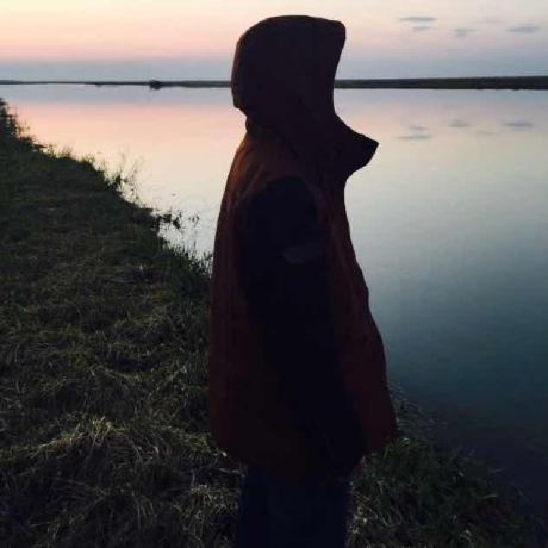

<div align="center">
<br>
<br>

  
<h1>sail-laboratory</h1>

<p>Sail 的实验室</p>
</div>


## 安装

克隆项目至本地

```bash
https://github.com/dlhandsome/sail-laboratory.git
```

## 在线体验

<br>

<br>

## 相关链接

- we-cropper
  - [项目地址](https://github.com/we-plugin/we-cropper)
  - [示例代码](./miniprogram/pages/we-cropper)
- we-debug
  - [项目地址](https://github.com/dlhandsome/we-debug)
  - [示例代码](./miniprogram/pages/we-debug)


